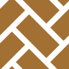
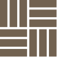

# 伝統文様 SVG

## 矢絣（やがすり）

## 鱗（うろこ）

## 市松（いちまつ）

## 麻の葉（あさのは）

## 七宝（しっぽう）

## 籠目（かごめ）

## 檜垣（ひがき）

## 立涌（たてわく）

## 亀甲（きっこう）

## 三崩し（さんくずし）

## 縞（しま）

## 鹿の子（かのこ）

## 釘抜き（くぎぬき）

## 青海波（せいがいは）

## 菱（ひし）

## 紗綾形（さやがた）

